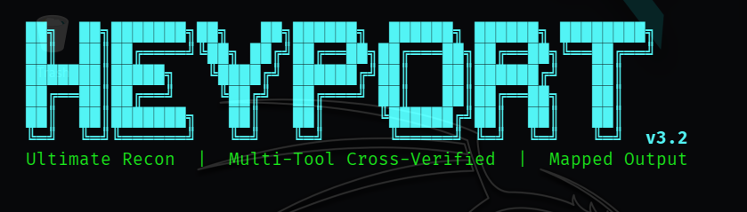

<!-- markdownlint-disable MD033 MD045 -->
<h1 align="center">
  <br>
  
  <br>
  HeyPort
  <br>
</h1>

<h4 align="center">Automated Recon Framework for Bug Bounty Hunters & Penetration Testers</h4>

<p align="center">
  
  
  
  
  
</p>

<p align="center">
  <b>One command → Full attack surface map</b><br>
  19 tools · 5 phases · Cross-verified output · Interactive HTML report
</p>

<p align="center">
  <a href="#features">Features</a> •
  <a href="#installation">Installation</a> •
  <a href="#usage">Usage</a> •
  <a href="#output">Output</a> •
  <a href="docs/how-it-works.md">How It Works</a> •
</p>
<!-- markdownlint-enable MD033 MD045 -->

---

## The Problem It Solves

Before HeyPort, a recon session looked like this: open 6 terminals, run tools in the wrong order, pipe output manually between them, forget to save something, end up with 15 disconnected text files — **two hours before you even started testing anything.**

HeyPort collapses that entire workflow into one command as:

```bash
python3 heyport.py -t target.com
```

---

## Features

### Subdomain Enumeration

- 10+ passive sources queried simultaneously (crt.sh, subfinder, assetfinder, BBOT, HackerTarget, AlienVault, RapidDNS, SecurityTrails, Chaos, VirusTotal)
- 3 active brute-force engines with wildcard detection (puredns, gobuster, dnsx)
- Smart mutation engine via alterx — finds subdomains no database has ever seen
- Cross-verification: subdomains found by 2+ independent sources marked **CONFIRMED**

### Smart Filtering

- HTTP probing across 14 ports (catches Grafana:3000, Jenkins:8080, Prometheus:9090, etc.)
- Automatic tier classification — tells you exactly where to start hacking
- Subdomain takeover detection across 50+ third-party services
- WAF fingerprinting with 200+ signatures

### Intelligence

- Cloudflare origin IP bypass (4 passive techniques)
- Year-prefix legacy infrastructure detection (`2017-grafana`, `2019-k8s`)
- Organization OSINT — company profile, GitHub org, IP ranges, breach history
- Shodan passive CVE lookup (zero packets to target)

### Report Output

- Single self-contained HTML report — dark theme, interactive, everything connected
- Structured `recon_map.json` for piping into other tools
- Priority target list (`p3_tier1_priority.txt`) — open and start hacking immediately
- Ctrl+C handling: first Ctrl+C completes the current phase, then stops the session and saves partial results (including `recon_map.json` + the HTML report); second Ctrl+C force-exits immediately.

---

## Installation

```bash

# Clone the repo
git clone https://github.com/Az3ll3/Heyport.git
cd Heyport

# Give execution permission to automated installer
chmod +x installation.sh

# Run automated setup (installs all dependencies)
# Installing dependencies gonna take a while grab a coffee ☕
./installation.sh
# Restart your shell once its done to load new PATH variables

# Verify tools are installed
python3 heyport.py --check-tools

# Start full recon
python3 heyport.py -t target.com
```

---

## Usage

```bash
# Full recon — all 5 phases
python3 heyport.py -t target.com

# Custom output directory
python3 heyport.py -t target.com -o /path/to/output

# Run a specific phase only
python3 heyport.py -t target.com --phase 2

# Skip vulnerability scanning (Phase 5)
python3 heyport.py -t target.com --skip-vuln

# Verify all tools are installed
python3 heyport.py --check-tools

# HAPPY HACKING!! 😀
```

---

## Output

```text
recon_output/target.com/YYYYMMDD_HHMMSS/
│
├── recon_report.html               ← Open this in browser
├── recon_map.json                  ← All data structured
│
├── p2_all_subdomains.txt           ← Every subdomain found
├── p2_confirmed_subdomains.txt     ← Cross-verified (2+ sources)
│
├── p3_dns_alive.txt                ← Resolving hostnames
├── p3_http_alive.txt               ← HTTP responding URLs
├── p3_tier1_priority.txt           ← ★ Attack these first
├── p3_takeover_risks.txt           ← Critical — subdomain takeovers
├── p3_waf_results.txt              ← WAF detections
│
├── p4_nmap_via_rustscan.txt        ← Full port scan results
│
├── p5_nuclei_pass1_critical_high.txt
├── p5_nuclei_pass2_medium.txt
└── p5_dalfox_xss.txt               ← Confirmed XSS POCs
```

---

## Tested On

- Kali Linux 2024+
- Python 3.8+
- Go 1.21+

---

## Legal Disclaimer

> **For authorized security research only.**
> Only use HeyPort against targets you have explicit written permission to test.
> The author is not responsible for any misuse.

---

## Author

Built by **[Hackr Az3ll3](https://github.com/Az3ll3)**, bug bounty hunter & security researcher.

---

## License

[MIT](LICENSE) free to use, modify, and distribute with attribution.
